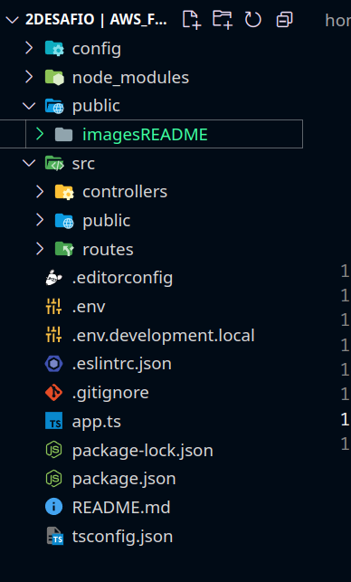
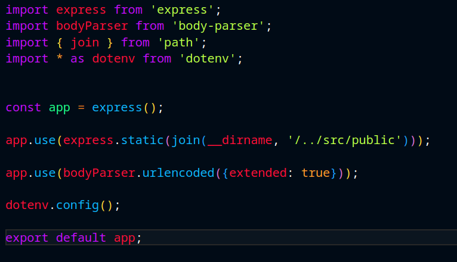
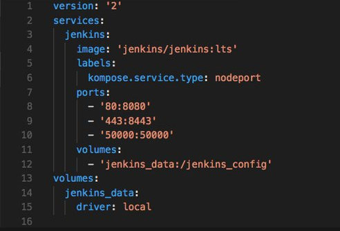

<!-- remember update all README when end project-->
# 2º Desafio | AWS_FULLSTACK_FEV24 - Projeto Compacine ️️
 

Este é o repositório do projeto "Login + Keep Alive" desenvolvido como parte do estágio na Compass UOL. Abaixo estão as informações importantes para o desenvolvimento, entrega e funcionalidades do projeto.

## Como instalar as dependências:
```sh
git clone https://github.com/EduardoMG12/Challenge-2---Squad-1-.git
cd Challenge-2---Squad-1-
npm install

```

## Como rodar o projeto:
```sh

npm run dev

```


<details>
  <summary>Algumas imagens o projeto </summary>
  
  
  <!--  remember add image configExpressProject when end project
   remember add image dockerConfigurations when end project
    remember add image first route when end project
    remember add image second route when end project
  and add other routes images if want
  squad image for some one daily
  --> 
</details>


## Sobre o desenvolvimento projeto.

### Descrição.

O projeto consiste em criar um CRUD completo de um sistema de cinema, Obrigatoriamente utilizando Express, ORM e Docker Compose. O Projeto deve seguir as especificações do [Notion](https://animated-beard-0ba.notion.site/2-Desafio-AWS_FULLSTACK_FEV24-8e410d1f653241cb8553c763d16d305c), com atenção especial ao prazo e os requisitos obrigatorios do projeto.

### *P.O*
- **Anthoni Bortolotto Martinelli:** [anthoni.martinelli@compasso.com.br](mailto:anthoni.martinelli@compasso.com.br)

### *Instrutores*
- **Rafaela Janeczko:** [rafaela.janeczko@compasso.com.br](mailto:rafaela.janeczko@compasso.com.br)
- **Maithe Saldanha Ferrao:** [maithe.ferrao@compasso.com.br](mailto:maithe.ferrao@compasso.com.br)
- **Cassio Silva Takarada:** [cassio.takarada@compasso.com.br](mailto:cassio.takarada@compasso.com.br)
- **Leonardo Buhring Muller:** [l.muller.dev@gmail.com](mailto:l.muller.dev@gmail.com)
- **Gabriel Bezerra Rodrigues:** [gabriel.bezerra@compasso.com.br](mailto:gabriel.bezerra@compasso.com.br)

### **Prazo**

Prazo para **envio** do e-mail com **link do repositório:** 09/04/2024  (terça-feira), **até às 17h30**.

## Sobre o desenvolvimento feito pela nossa Squad

### Squad: 

- [**Claudio Renato**](https://github.com/claudiofariias)
- [**Charles Eduardo**](https://github.com/EduardoMG12)
- [**Edenilson Costa**](https://github.com/gameprime)
- [**Fabio Aparecido**](https://github.com/fabusilva)
- [**Patrick Sampaio**](https://github.com/PatrickSampa)

### Trello:
[Trello](https://trello.com/invite/b/Je4JEUey/ATTI918cd14197eb633febcad331e5dce02e59691D70/projeto-compacine)

### Descrição:

### Dificuldades do projeto:
